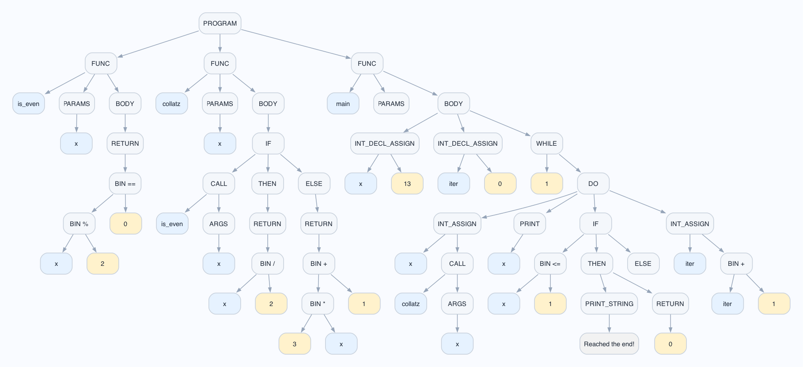
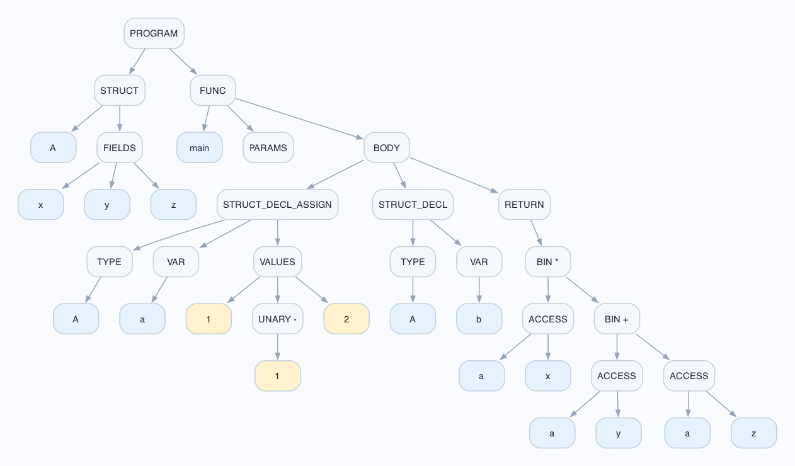

# ScriptInterpreterInCpp

A C++23 interpreter pipeline for a small custom language (`ds_lang`), built end-to-end:

`source code -> lexer -> parser(AST) -> bytecode builder -> VM execution`

This repository is focused on compiler/interpreter fundamentals implemented from scratch, with tests and AST visualization support.

## What this project includes

- A lexer with token location metadata (`line`, `column`) and language keywords/operators.
- A Pratt-style expression parser and a typed AST model.
- Statement parsing for:
  - variable declaration/assignment (`int`)
  - functions (`func`)
  - control flow (`if`, `else`, `while`, `return`)
  - struct declarations/assignments and field access
  - print statements (`print <expr>` and `print "<string>"`)
- A bytecode compiler (`BytecodeBuilder`) from AST to a compact VM instruction set.
- A stack-based virtual machine with function calls, locals, jumps, arithmetic/logical ops, and output buffering.
- Graphviz AST export (`.dot`) and rendered diagrams (`.png`).
- Unit tests for lexer, parser, utility helpers, VM behavior, and bytecode generation.

## AST visualizations

### Collatz example (`examples/collatz.ds`)

Implements `is_even`, `collatz`, and a `main` loop that repeatedly applies the Collatz step, prints each value, and exits when `x <= 1`.



### Struct example (`examples/struct.ds`)

Defines a `Vec3i` struct, builds struct instances, uses field access (`v.x`, `v.y`, `v.z`), and computes vector math through helper functions.



## Repository layout

- `ds_lang/include`: core headers (lexer/parser/bytecode/vm).
- `ds_lang/src`: implementation files.
- `ds_lang/app/main.cpp`: CLI runner.
- `ds_lang/tests`: test executables.
- `examples`: sample `.ds` programs and AST diagrams.

## Example code (Collatz)

```ds
func is_even(x) {
    return (x % 2) == 0;
}

func collatz(x) {
    if(is_even(x)) {
        return x / 2;
    } else {
        return 3 * x + 1;
    }
}

func main() {
    int x = 13;
    int iter = 0;
    while (true) {
        x = collatz(x);
        print(x);
        if (x <= 1) {
            print "Reached the end!";
            return 0;
        }
        iter = iter + 1;
    }
}
```

## Sample output

Example output from running the program through the full pipeline (tokens, statements, bytecode, VM trace):

```text
Tokens:
Token{kind=KWFunc, lexeme="func", line=0, column=0}
Token{kind=Identifier, lexeme="is_even", line=0, column=5}
Token{kind=LParen, lexeme="(", line=0, column=12}
Token{kind=Identifier, lexeme="x", line=0, column=13}
Token{kind=RParen, lexeme=")", line=0, column=14}
Token{kind=LBrace, lexeme="{", line=0, column=16}
...
Token{kind=RBrace, lexeme="}", line=24, column=0}
Token{kind=Eof, lexeme="", line=24, column=1}

Statements:
[000]
func is_even(x) {
    return x % 2 == 0;
}
[001]
func collatz(x) {
    if (is_even(x)) {
        return x / 2;
    else
        return 3 * x + 1;
    }
}
[002]
func main() {
    int x = 13;
    int iter = 0;
    while (1) {
        x = collatz(x);
        print x;
        if (x <= 1) {
            print "Reached the end!";
            return 0;
        }
        iter = iter + 1;
    }
}

Bytecode:
Function 0:
  num_params = 1
  num_locals = 1
     0: LOAD_LOCAL 0
     1: PUSH_I64 2
     2: MOD
     3: PUSH_I64 0
     4: EQ
     5: RETURN
Function 1:
  num_params = 1
  num_locals = 1
     0: LOAD_LOCAL 0
     1: CALL_ARGS 0 1
     2: JMP_FALSE 8
     3: LOAD_LOCAL 0
     4: PUSH_I64 2
     5: DIV
     6: RETURN
     7: JMP 14
     8: PUSH_I64 3
     9: LOAD_LOCAL 0
    10: MULT
    11: PUSH_I64 1
    12: ADD
    13: RETURN
Function 2:
  num_params = 0
  num_locals = 2
     0: PUSH_I64 13
     1: STORE_LOCAL 0
     2: PUSH_I64 0
     3: STORE_LOCAL 1
     4: PUSH_I64 1
     5: JMP_FALSE 24
     6: LOAD_LOCAL 0
     7: CALL_ARGS 1 1
     8: STORE_LOCAL 0
     9: LOAD_LOCAL 0
    10: PRINT
    11: POP
    12: LOAD_LOCAL 0
    13: PUSH_I64 1
    14: LE
    15: JMP_FALSE 19
    16: PRINT "Reached the end!"
    17: PUSH_I64 0
    18: RETURN
    19: LOAD_LOCAL 1
    20: PUSH_I64 1
    21: ADD
    22: STORE_LOCAL 1
    23: JMP 4
    24: PUSH_I64 0
    25: RETURN

VM Print: [40]
VM Print: [20]
VM Print: [10]
VM Print: [5]
VM Print: [16]
VM Print: [8]
VM Print: [4]
VM Print: [2]
VM Print: [1]
VM PrintString: [Reached the end!]
Return Value = 0
```

## Build

### Debug

```bash
cmake -S ds_lang -B build -DCMAKE_BUILD_TYPE=Debug
cmake --build build -j
```

### Release

```bash
cmake -S ds_lang -B build -DCMAKE_BUILD_TYPE=Release
cmake --build build -j
```

## Run the CLI

```bash
./build/ds_lang_cli
```

## Run tests

```bash
ctest --test-dir build --output-on-failure
```

## Render DOT to PNG manually

```bash
dot -Tpng examples/collatz.dot -o examples/collatz.png
dot -Tpng examples/struct.dot -o examples/struct.png
```
